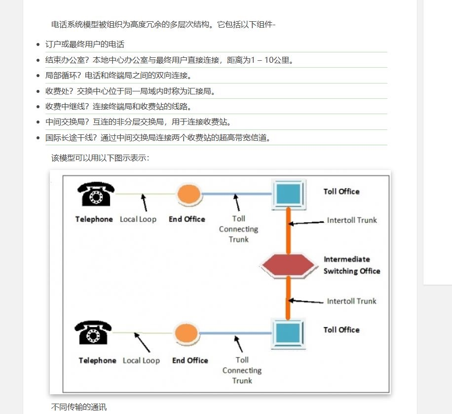

\1.    The cable between toll office and the end office of telephone company are known as the  ________. 

A. local loop      **B. trunk**     C. microwave line     D. coaxial cable

 

\2.    It is impossible for ________ to cause transmission impairments of telephone local loop. 

A.  different Fourier components propagating at different speed

B.  thermal noise

C.  crosstalk between two close wires 

**D.  multipath fading**

\1.    If a binary signal is sent over a 3-kHz channel whose signal-to-noise ratio S/N is 31, what is the maximum achievable data rate?

**A. 6 kbps**        B. 12 kbps        C. 15 kbps  D. 18 kbps

\1.    The three central concepts of the OSI model are ________.

**A. services, interfaces and protocols**          B. architecture, model and switching

C. subnet, layering and port                   D. protocols, layers and interfaces

 

\2.    Once upon a time, people thought that the OSI model and its protocols were going to take over the world and push everything else out of their way. This did not happen. Why? A look back at some of the reasons may be useful. They can be summarized as following except for _______:

A. Bad timing.  B. Bad technology.   **C. Bad price.**   D. Bad implementations.

\1.    With Hamming code, the code which can correct 3 bit errors at most may detect at most ________ error(s).

A. 5       B.6    **C.7**       D. 8

注意这里是最多，7/8码距汉明码都是纠3bit

\1.    What is the baud rate of classic 10-Mbps Ethernet? 

A. 10M      B. 15M      **C. 20M**       D. 25M

\1.    The hosts connected by a single new router may belong to 

A. the same collision domain and the same broadcast domain

B. the same collision domain but different broadcast domains

C. the same broadcast domain but different collision domains

**D. different collision domains and different broadcast domains**

\1.    Which is not the CSMA／CA rule of 802.11?

A. If station X received RTS of station A, X must remain silent for a short time so that X will not interfere with A’s receipt of CTS. 

B. If station X received RTS, but did not receive CTS, then X can transmit its data and will not interfere with other stations. 。

C. If station X has not received RTS, but received CTS, then X may not transmit its data..

**D. If station X has received both RTS and CTS, then X may transmit its data.**

\1.    The IP protocol provides for ______ service.

A.   reliable and connection-oriented

B.   non-routable

**C.   unreliable and connectionless**

D.   none of the above

可不可靠，有没有连接只管当前，不管下层

\1.    In the TCP / IP reference model, _____ provides a direct service for ICMP. 

A. PPP    **B. IP**           C. UDP     D. TCP

\1.    ______ is a small java program that has been compiled into binary instruction running in JVM, and can be embedded into HTML pages, interpreted by JVM-capable browsers.

A.   JavaScript   B. JavaBean  **C. Applet**  D. JSP

\1.    There are two types of transmission technology that are in widespread use. They are Point-to-point links and  ________ .

**A. Broadcast links.**           B. end-to-end links    

C. peer-to-peer links      D. virtual links.

\1.    Which key will be used if A wants to send encrypted data to B when using public-key algorithms? 

A. The public key of A       B. The private key of A

**C. The public key of B**       D. The private key of B