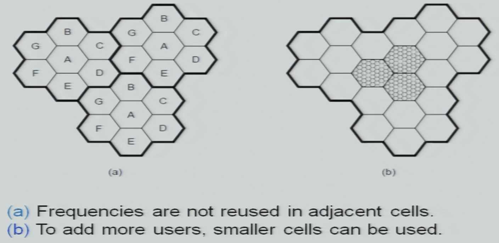
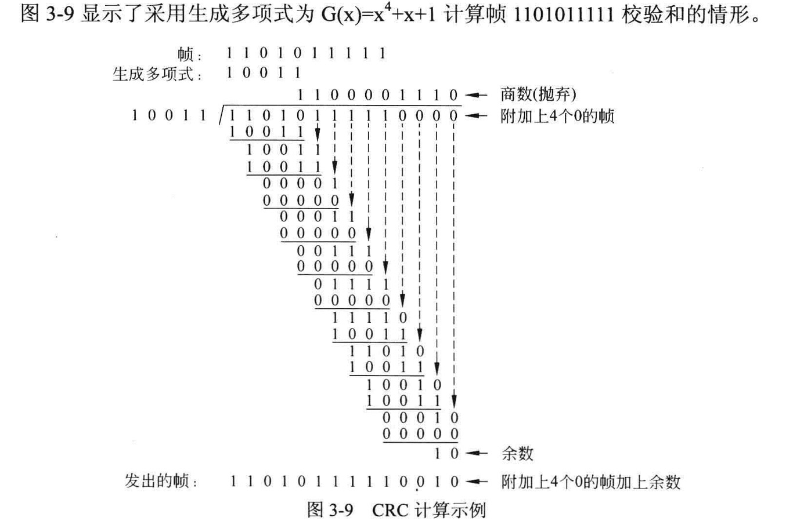
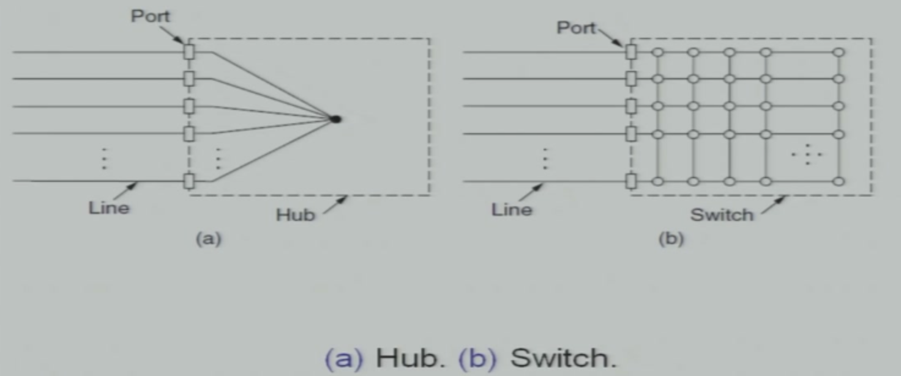
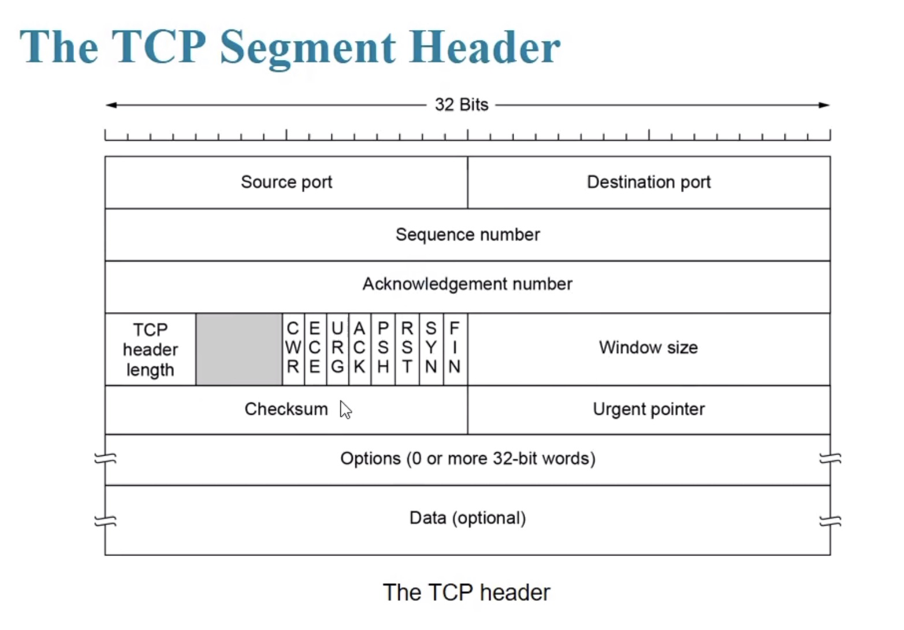

# 第一章 七层网络协议

## 1 Physical

物理上相邻的两个节点之间传输比特流的方式。注意传输具体使用的物理介质并不是网络协议的组成部分。

传输的基本单元是Bit。

## 2 DataLink

关键是如何从物理层的比特流中识别并划分帧。

同时数据链路层还负责差错控制和流量控制。

传输的基本单元是Frame。

## 3 NetWork

前两层都是面向直连设备的协议，而网络层负责将两两直连的设备们串接成网。

具体内容包括路由的选择、中继和互联。

传输的基本单元是Packet。

## 4 Transport

传输层提供端对端的服务，端对端意味着用户不需要关心数据的具体发送途径。同时敏感数据在传输中途不落地解包，这也由传输层控制。

传输的基本单元是TPDU（Transport Protocol Data Unit）。

## 5 Session

会话层，对应到线程。

## 6 Presentation

表示层，负责解释传输的内容，比如大小端等。

## 7 Application

应用层，用于提供统一的抽象的服务。

# 第二章 Pysical

## 2.1 数据通信的理论基础

### Nyquist's Theorem

$$
最大信息传输速率\ =\ 2B\ log_2 K\ bits\ per\ sec. \\
其中B是信道带宽，K是码元的离散电平数 \\
但这是无噪声的理想条件
$$

### Shannon's Formula

$$
最大信息传输速率\ =\ B\ log_2(1+\frac{S}{N})\ bits\ per\ sec. \\
其中B是信道带宽，\frac{S}{N}是信噪比 \\
相比奈奎斯特定理引入了噪声的影响
$$

应用领域比如扩频通信（降低S/N以达到保密的效果，增大B以保证通信）。

## 2.2 传播介质

### 线缆

电缆：双绞线（绞线是为了抗干扰）、同轴线（电气性能好但贵）、电力载波

光缆（带宽极大）

### 无线传输

天空所有人共用，所以无线电频段需要管制：

- ISM：特定协议的公用频段，比如蓝牙、wifi等都在此列
- 微波：也叫视距通讯，因为微波信号方向性强、容易被遮挡，也会被水汽吸收，类似可见光

### 卫星通信

卫星通信使用微波，它突出的特点是：

- 微波有指向性，而卫星跑得快，所以需要信号追踪
- 卫星距离远，通信延迟很大

### 胖管道

通信速率与通信延迟的乘积代表了这条通信线路上有多少数据已经发出而没有被接收。这个乘积较大的通信线路称为胖管道。

主干网络（通信速率极大）和卫星通信（通信延迟很高）都是胖管道。胖管道的协议需要定制。

## 2.3 信号传输

### 基带信号 Bassband

- 从bit串直接翻译为方波，从a到b
- 为了采样当然应该采在周期中间（信号最好）而不是周期的交界处，所以相位前移半个周期，从b到c/d
  - 形如c/d的信号就可以用于传输了，但是此时的信号完全依赖于时钟周期，而在设备间保持时钟同步非常困难。有两种解决方法
    - 异步通信：每次传输一个很小单位的数据，并在单位数据前后加上起始和中止信号用于同步时钟（传输单位数据用时很短，只要在这个很短的时间里保持时钟同步即可）。在数据单位内部的传输是周期同步的，但数据单位之间的间隔不固定。缺点是损失贷款
    - 同步通信：限于有线通信，增加额外的线路专门用于传递时钟信号。缺点是贵。
- 上述两种方式都有缺点，所以发明了曼彻斯特编码。通过特殊的编码规则将数字信号和时钟信号结合在一起。但是它也有缺点，**它的带宽有一半被用来传输时钟，或者说为了将时钟编入数字信号，它的频率提高了一倍**。

### 通带信号 Passband

利用模拟信号承载、传输数字信号。

b对a调幅（AM），c对a调频（FM），d对a调相（PM）。三种方式均可用。

## 2.4 信道复用

### 频分复用 FDM

多路信号分布在不同的大频段中不同小频段上，用特定频段的滤波器进行区分。相邻小频段之间需要保护频段（**Guard band**）防止串扰。

例如6个信道，各自需要4kHz，保护带宽度200Hz，则共需要4k\*6+0.2k\*5=25kHz带宽。

### 正交频分复用 OFDM

信号之间相差带宽的一半，通过数学手段进行区分。

### 时分复用 TDM

传输的数据不连续，只要间隔时间够短人就感觉不出来。

### 码分复用 CDM

通过不同的编码方式，将同一个信道均分给多个用户。

## 2.5 有线网络

### 有线电话的语音线路

- Local loop
  - 本地线，从有线电话到交换机。
  - 全部频段用户独占。
  - 两线制，说话和收听走同一回路。（两线制回音会引起啸叫，需要额外电路消除）
- Trunk
  - 中继线，端局之间。（端局又可以再分很多级）
  - 严格的复用，4khz。
  - 四线制，两个方向的声音各走一条回路。（也可以多个四线制并行提高贷款）

### 中继线的复用

对语音线路，音量小的需要采样更精细，音量大的可以相对粗糙一些。编码时实际会取对数。

每帧用1bit作为帧同步信号，每一个信道又用1bit作为信道区分的信号。

若干信道时分复用整合为T1，T1又可以向上继续整合。除了这种整合方式之外还有E格式，见教材。

除了这种方法之外还有SONET/SDH的协议格式，自行了解。

### 利线电话网传输数据

因为电话网中继线是严格的4kHz频分复用，所以不能直接用基带信号来传输数据，只能用**通带信号**。

需要将数字信号调制为模拟信号，电话网中以模拟信号传输，到端后再解调为数字信号。这个过程需要**调制解调器（Modern 猫）**。达到了56Kbps的速度。

这种方式已经几乎无人使用。

### (A)DSL

Digital Subscriber Line数字用户线路。上面提到过本地线的全部频段都是由用户独占的，本地线的带宽远远大于4kHz，所以人们想办法把这一部分利用起来。

**在本地线中**，最低4kHz给语音通话，而在更高的频段上编码基带信号传输网络数据。因为普通用户对下载的需求远远高于对上传的需求，所以DSL协议中上下行是不对称的，下行大于上行，所以它也叫**A.symmetric DSL**。（图中是时分复用便于理解，实际上用的是正交时分复用）

ADSL充分利用了本地线路。但是注意语音和数据只在本地线中并行，在端局语音和数据再次分离，走各自的网络。

### FTTX

Fiber，光纤网络，下面两种统称为FTTX。

- FTTR：Fiber To The Road，光纤到路边，再用调制成电信号传统的线路连到用户家中。
- FTTH：Fiber To The Home，光纤到用户直接到用户，用户端用光猫转换成电信号再给数码设备。**但是光线入户并不意味着家家户户直连端局。**
  - FTTH也有类似FTTR的总-分结构，无源的spliter负责纯粹从物理上将下行线路分给各家各户；上行线路各家共用，另有算法保证数据安全和传输可靠。
  - 同时FTTH当然也可以向下兼容传输数据，由光猫负责调制解调。
  - 

### Switching

### 信令

除了数据（包括语音和网络数据）之外，还需要各种控制信号辅助网络连通，称为信令。

- 随路信令，控制信号严格意义上的和数据编码在一起，共同传输。
- 共路信令，控制信号不和数据绑定。**现在用的都是共路信令，比如上图Switching中，信令会先传给所有交换机，再由交换机网络背后的控制器决定数据到底如何传输。信令和数据不是绑定传输的。**

## 2.6 移动网络

### 1G

- 模拟信号
- 只支持话音，不支持数据（非要用modern调成模拟信号来传输理论上也可行，虽然没人这么干）
- 普通的频分复用
- **创造了蜂窝的概念，至今仍然在用：**
  - 基站覆盖范围如蜂窝般密铺
  - 任意设备都有离得近的基站，发射功率得到控制
  - 不相邻的基站可以复用频段不会产生干扰
  - 

### 2G

- 从二代开始全部采用数字信号传输
- 只支持话音，不支持数据（尽管理论上可行）
- **GSM协议基本架构：**
  - **设备移动时的位置追踪：**
    - HLR（归属位置寄存器）
      - 本地归属所有移动设备的信息
    - VLR（拜访位置寄存器）
      - 外地归属而目前在本地的移动设备的信息，信息怎么从归属地的HLR到本地的VLR运营商会控制
    - 设备每次搜索并连接到附近最近的一个基站时，都会重新注册/更新HLR、VLR中的信息
  - **呼叫时**查询本地VLR、HLR即可知道基站数否需要服务该用户。
  - **被叫时**先查归属地的HLR，里面会有这个用户当前在哪个地区的VLR里（怎么知道的由运营商控制），然后联络当前所在地生成一个归属于所在地的临时虚拟号码，重新拨号。
  - 
- 其实有GSM/CMDA两套协议，中国都有。主要是编码区别，架构大致相同。

### 3G

- 设计之初同时支持话音和数据
  - 可以见到核心网有两套，一套管话音一套管数据
  - 复用技术基本上为CDMA（高通把持大量收费专利，直接导致后来没人用）
  - 

### 4G

- 从4G开始只有数据没有话音，核心网又只剩下了一套
- 芯片的进步让一个基站做完了原先多部设备共同完成的事情
- 复用方式基本上是OFDM正交频分复用
- 

### 5G

- eMBB增强移动宽带
- mMTC海量机器类通信
- uRLLC超可靠低时延通信

# 第三章 Data Link

## 3.1 分帧

数据链路层的传输单位是帧Frame。最首要的问题是，如何从bit流中快速高效的区分出帧。

- **字节计数**，每个帧的第一个byte表示这一帧的长度。这种方法简单但是同步性极差，其中任何一个bit丢失或计数byte出错则从此之后全错。
  - 
- **字节填充**，在每个帧的首尾加上特殊的标志字节作为区别。为了避免数据字节和填充的字节相冲突，还需要逃逸字节用于标识后一个字节的状态。
- **比特填充**，在bit粒度上首尾加上特殊bit作为区别。为了避免数据bit和填充的bit相冲突，需要约定数据bit流中出现特定格式时如何改换。
  - 实际用的是在数据首尾填充0111_1110，所以在数据部分不允许出现连续六个1，每读到连续的5个1就要在之后补一个0。
  - 

## 3.2 差错控制

检错码只负责检验错误，不能更正，比如奇偶校验、**多项式校验**。

而纠错码可以知道哪里传输发生了错误，并自动纠错，典型的例子比如**汉明码**。

### 多项式校验CRC

将收到的数据视作GF(2)下的多项式的系数。信息发送和接收双方约定一个除数多项式，校验码是收到的数据作为被除数得到的余数。

### 汉明码

设将要进行检测的二进制码为n bit，为使其具有纠错能力，需要再加上k位的检测位，组成n+k位的代码。那么，新增加的检测位数k应满足：$2^k \ge n+k+1$。（后面会看见为什么）

1. 不妨设要传输的信息有7个bit，为0110110；根据上述公式计算得k=4，信息总长为11bit。

2. 将k bit的校验码放在信息的2的整数次方bit上

   | dec编号 | 1    | 2    | 3    | 4    | 5    | 6    | 7    | 8    | 9    | 10   | 11   |
   | ------- | ---- | ---- | ---- | ---- | ---- | ---- | ---- | ---- | ---- | ---- | ---- |
   | bin编号 | 0001 | 0010 | 0011 | 0100 | 0101 | 0110 | 0111 | 1000 | 1001 | 1010 | 1011 |
   | 数据    | 校验 | 校验 | 0    | 校验 | 1    | 1    | 0    | 校验 | 1    | 1    | 0    |

3. **放在0001位置的校验码对所有bin编号第1个bit为1的位做奇偶校验；放在0010位置的校验码对所有bin编号第2个bit为1的位做奇偶校验……下面以偶校验为例：**

   | dec编号 | 1                             | 3    | 5    | 7    | 9    | 11   |
   | ------- | ----------------------------- | ---- | ---- | ---- | ---- | ---- |
   | bin编号 | 0001                          | 0011 | 0101 | 0111 | 1001 | 1011 |
   | 数据    | 1（对{3, 5, 7, 9, 11}偶校验） | 0    | 1    | 0    | 1    | 0    |

   | dec编号 | 2                              | 3    | 6    | 7    | 10   | 11   |
   | ------- | ------------------------------ | ---- | ---- | ---- | ---- | ---- |
   | bin编号 | 0010                           | 0011 | 0110 | 0111 | 1010 | 1011 |
   | 数据    | 1（对{3, 6, 7, 10, 11}偶校验） | 0    | 1    | 0    | 1    | 0    |

   以此类推。

4. 上面的k个校验码对所有的数据位做了标记。例如假设1001位数据出错，则1000和0001校验位会出错，而0100和0010校验位正确。于是汉明码实现了对任意1bit的错误可以实现自动纠错，而对多个bit的错误也可以实现识别。

## 3.3 流量控制

接收方不一定有能力跟上发送方，因此需要流量控制：

- **Unrestricted Protocol**
  - 没有限制，随便发
- **Stop-and-Wait Protocol**
  - 接收方收到一个帧之后发送一个反馈，发送方收到前一个帧的反馈后才发送下一个帧
  - 称停止等待协议，也叫**ACK协议**
- **Protocol for Noisy Channel**
  - 现在引入噪声，传输的帧可能出错
  - 引入正确/错误两个返回
    - 接收方的反馈有正确/错误两种
    - 发送方得到正确反馈才发下一个帧，得到错误反馈则重发前一个帧
  - 引入超时
    - 发送方要做定时器，一定时间内没有响应就要重发，以处理丢帧
    - 一般超时值是电路一个来回的时间加上一点点富余
  - 引入ID
    - 如果不是数据丢帧而是反馈信息丢了，发送者也会重发
    - 接受者需要通过帧中的ID判断下一个帧和前一个帧是不是同一个
    - 因为只需要前后对比，所以只需要1个bit让前后两者能够区分即可

## 3.4 滑动窗口

**滑动窗口是最常用的流量控制。**

上面一唱一和的协作方式效率太低。自然的想到可以一次多发几个帧，增大吞吐量。

- 一次多发几个帧意味着同时可能有超过一个帧处于已发送未接受的Suspend状态，Suspend帧允许的最大数量即所谓“窗口”的大小
- 因为窗口内同时有多个帧，在出错/丢帧时又有两种处理：
  - Go Back N：某个帧出错/丢失，其后所有的帧都作废重传。
  - Selective Repeat：接收方需要精准的告诉发送方哪个帧需要重传，其他的帧不受影响
- 因为反馈应答也需要占信道，我们又有两个优化：
  - **累积应答：**使用GBN策略时可以不逐帧应答，应答N表示N以前的帧都收到了
    - **这里收到的帧可以包含N（N及N以前都收到了）也可以不包含（N以前的都收到了，现在期待收到N）**，两种都可以，只要约定清楚即可。
  
  - **稍带应答：**应答信息可以作为随数据帧的一部分发送，而不需要单独发送
    - GBN策略使用捎带应答时，如果需要重传，只要ID和数据部分与原来的帧相同即可，应答部分可以携带最新的数据而与原来不同
  

### 原理图

- 发送方的阴影表示已经发送而没有收到回应的帧
- 接收方的阴影表示当前应该收到的帧，不应该收到任何阴影区之外的帧
- 3-bit Sequence Number表示用于区分帧的ID有3bit，体现在上面的圆形被分为8份，每8个帧就会重用一遍ID
- Window Size 1体现在阴影区的大小不大于1
  - 窗口大小应该分为发送方和接收方，两者可以不同

### 重传策略与窗口大小

- **发送方和接收方的窗口大小加在一起不大于2^N**（N为帧序号长度）
  - 如果双方窗口大小大于2^N
  - 那么双方的Suspend帧序号将会有重叠，造成ACK歧义
  - 比如N=3，发送窗口大小6，接收窗口大小3
    - 发送方suspend 0-5号帧
    - 接收方期待6、7、0号帧
    - 接收方ACK5丢包，发送方重传本轮0号帧时，接收方不知道这是前一轮的重传还是新一轮的帧
- Go Back N
  - 接收方要求顺序接收，窗口大小只能是1
  - 所以发送方窗口的最大值是$2^{N}-1$

- Selective Repeat
  - 默认双方对称，Window Size的最大值都是$2^{N-1}$

### HDLC

- 面向比特，只能只能用做同步协议
- 首尾用0111_1110作为起止标志
  - **为了不和flag冲突，其余部分凡是遇到连续的5个1就补一个0**
  - 例如01111101111110，在发送中自动补为0111110011111010

- 后面有16bit校验位，使用CRC
- Address是接收方地址，但是没什么用因为HDLC一般用在点对点电路
  - 没事找事的被拿来作为区分命令帧还是相应帧
- **Control控制字段是重点**

- **I帧/信息帧**
  - Seq为发送方帧序号
  - Next为接收方**下一个期待收到的帧序号**，且其之前的帧都已经收到
  - P/F-bit为1时对方必须立刻给出一个回应，下同
- **S帧/监控帧**
  - Type分四类
    - 00：Receive Ready，当前可以接收帧，Next是期望的下一个帧
    - 01：Reject，要求对方将Next编号之后的帧重发
    - 10：Receive Not Ready，Next之前的帧都已经接收到，但是目前正忙请不要发新的帧
    - 11：Selective Reject，要求对方单独重发编号Next的帧
- **U帧/无序号帧**
  - 处理了各种麻烦的事情
  - Type+Modifier共5bit表达了各种情况
  - 帧括链接建立、链接断开、非常规纠错、用U帧传输不需要应答的数据等等

### PPP

HDLC加了很多标志、校验、控制字段，虽然一般被用于点对点传输但是保留了多对多的传输能力。这带来了很大的浪费。

PPP是一个专注于点对点通信的协议，也砍掉了很多HDLC的额外功能，使其使用更便捷。

- 注意上图的单位是字节，使其可以用做异步协议
- Flag与HDLC相同
- Addr、Ctrl写死，为了与HDLC兼容（在一些场景中可以将其省略压缩，反正是固定的）
- Protocol表达了Payload与Checksum的格式、长度等信息

# 第四章 MAC Sublayer

第三章专注于点对点的电路，第四章Medium Access Control Sublayer则讨论广域网多对多通信的控制和动态分配问题，仍然属于数据链路层。

在具体展开第四章之前，我们需要适当简化一些条件：

- Independent Traffic 流量独立，节点之间只有我们正在讨论的一种联络方式，除此之外没有其他信息流

- Single Channel 单通道，每个节点联通外界的线路是唯一的

## 4.1 访问控制协议

### ALOHA

最早的中间层协议是ALOHA。

单个频段，想发就发，不做载波侦听，不做冲突检测，纠错完全给上层。从发送时序上可以细分三种：

- 连续时间，也叫**纯ALOHA**，想发就发
  - **纯ALOHA的信道利用率最大值为0.184，记结论**

- 离散时间，也叫**时隙ALOHA**，各节点需要同步，只有在同步点可以收发
  - 帧必须在两个同步点之间的时间内发送完毕，不允许跨时间片
  - **时隙ALOHA的信道利用率最大值为0.368，恰好是纯ALOHA的两倍**

- 离散时间，且需要先发一周期“申请”，申请通过后才发若干周期的数据

### CSMA

CSMA载波侦听，发送者可以监听信道，当前有人正在发送则等待（也意味着只能半双工）。侦听到冲突时有几种策略：

- 持续侦听（Persistent 1坚持）
- 隔一段时间再次侦听（Non-Persistent 0坚持）
- 随机决定当前是持续侦听还是干点别的过一回再来（n-Persistent $n\in(0,1)$ 表示持续侦听的概率）

### CSMA/CD

载波侦听只能保证某个信号源发送那一刻没有冲突，无法解决两束信号在线路中途发生碰撞，这就需要**Collision Detection冲突检测**。CD不需要掌握怎么从模电上判断是否发生了碰撞，我们只关心原理。

称信号在网络上**最远的两点**之间跑一个来回的时间，在CD中称**争用期**：

- 每个包的数据传输时间必须大于争用期，这样才能在这个包发完之前知道是否发生了碰撞，是否需要重发
- CSMA/CD下如果发送方在争用期内没有收到碰撞信息，则此后也一定不会发生碰撞
- 10Mbps以太网规定51.2us为RTT，**所以MAC帧长度不得小于512bit**
- 发生冲突后自动重传，**二进制指数回退算法**
  - 第一次重传在{0, 2^1-1}中随机取一个数做倍数，乘以RTT作为退避时间，退避后重传
  - 如果第一次重传又遇到碰撞，第二次重传在{0, 1, 2, 2^2-1}中随机取一个数做RTT的倍数
  - **在第10次重传后取值范围不在指数延长，保持在0～1023 (2^10-1)**
  - **最多可以尝试重传16次，连续16次不成功就彻底放弃**

### CSMA/CA

#### 无线网络的新问题

CSMA-CD一般用于有线网络。无线网相比有线网传输范围小，信噪比低，信号不是点对点传输而是球面扩散，这带来一些额外的问题。

- **隐藏终端：**AC两者有冲突，但是因为需要中继，双方发送之初并不能相互检测
  - 
- **终端暴露：**B发给A，C发给D，本来没有冲突。但是两者信道可能会打架，相互干扰；也可能被误判为两者有冲突。
  - 

#### MACA

MACA冲突避免。**注意冲突避免指的是协议在尽可能的避免冲突，而不是这个协议之下没有任何冲突。**

A想发包给B，先发一个RTS声明信道上将有一个包、谁发给谁、大概要多久等等。B收到RTS并做好准备之后，回一个CTS应答。握手完成后才能开始传输。

除A之外收到CTS的节点，将知道自己在B的传输距离之内，且信道即将被A、B占用，此时应该停止发送数据，接下来的信号也不需要接收。

现实使用的Wifi用的CSMA/CA和MACA很像了。

#### CSMA/CA

下面WLAN讲。

## 4.2 Ethernet

### 传统以太网

总线式以太网拓扑结构如上，使用CSMA-CD策略。具体帧格式如下：

两种标准，大同小异。上图的数字单位是字节。

- 4Byte Checksum CRC校验
  - 以太网一般认为信噪较为优越，采用无连接方式（不需要握手建立连接），也只做帧内校验不考虑丢包
- 6Byte MAC地址，表达信息收发双方
- 8Byte Preamble，62个连续的1010... + 11，用于分帧
  - 上图两种协议其实只有叫法不用，画图不同，规则是一样的
- Pad填充字段，为了实现前一节包大小的要求，可能需要填充**，同时MAC层的帧至少需要64字节**
- Type表示Data部分的协议类型
  - 但是这是政治不正确的，协议各层一般认为应该互不干扰，所以另一种方案是两者两个Byte改为表示Data+Pad的长度
  - 但是Length其实也是没事找事，因为你也不知道Data有多长，还是需要上层提供额外信信息
  - 现在两种帧格式可以并存，因为当年设计协议时，Type的编码都是1500以上，**而Length不大于1500**。通过这两个Byte的值即可判断帧格式。

###  After Ethernet

传统Ethernet只有一根总线，可维护性差而冲突性高。

一种改进方式是Hub，逻辑结构和总线其实没有区别但是物理接线方式有变化，从直链变成星形，提高了可维护性。

随着电子电路的进步，出现了另一种改进方式Switch，它从根本上改变了逻辑结构，从总线变为网状结构，网的每一个交叉点都是交换机。它根本上解决了冲突问题，极大的提高了网络总流量。但是也带来了新的问题：怎么确定数据的路径？（见4.5节）

交换机的又可以分为两种：

- Cut-Through直通式，只根据目标地址做转发，即收即发没有缓存，延迟小但是纠错码没用了因为不检查，并且不能在速率不同的线路之间交换
- Store-and-Forward储存转发式，缓存收到的每个帧并做检查，检查有误则丢弃，无误才继续转发。利用了纠错码，并且因为有缓存，收发可以工作在不同速率下，但是延迟高。

## 4.3 WLAN

WLAN协议解决原理引入中提到的问题的核心思路是无线网络只覆盖比较小的范围，在这个小范围内设备总是直连，不允许中继，以此规避终端隐藏和暴露问题：

- **AP方式：**
  - 各个设备只能与AP通讯，AP之间往往使用有线网
  - 和MACA一样，都要先向AP发RTS请求，AP收到请求后广播携带唯一源信息的CTS
  - 源收到CTS则开始发数据，其他终端收到CTS则主动静默
  - 数据接收完毕后AP广播ACK，所有终端收到ACK本轮静默结束
  - 帧之间必须有**帧间间隔IFS**，用于解决终端到AP距离不一致，传输时间也不一致的问题
  - IFS其实有三种各自在不同的时候用，碰撞后的处理也和Ethernet稍有区别，这里不展开
- **Ad-hoc方式：**
  - 无组织方式，小范围设备间自组网，均为直接通信不允许中继
  - 其他内容同AP方式

注意WLAN协议同时规定了物理层和数据链路层。有时设备连接Wlan时不会跑最高等的协议，很可能是物理层有冲突或限制，不仅是数据链路的问题。

##  4.4 BlueTooth

蓝牙设计之初就是为了低速率小范围但是低功耗低价格通信。知道它是主从结构即可。

## 4.5 连接小局域网成大网

有线局域网使用网桥互联，它与Switch结构的以太网思路相同，只不过尺度更大一层。它也需要解决转发表如何生成的问题。

其实到这里基本就是Internet层的东西了，转发表的生成将在第五章讨论。

## 4.6 VLAN

局域网是一个广播域，其中包含的计算机过多的时候，广播的开销可能过大，同时广播的性质决定了其对信息安全不利。所以需要虚拟局域网，将物理上互联的局域网继续细分。

上面的帧结构协议为802.1Q，相比802.3（以太网帧格式协议）增加了四个VLAN 标识0x8100+Tag四个字节，

- 0x8100标志这是一个VLAN帧，因为802.3中对应位置为Length/Type而0x8100对两者都不合理，VLAN协议与Ethernet协议可以兼容
- VID为虚拟广播域号，长12bit，由网桥/交换机负责根据VID决定其广播域范围

## 附录 设备分类

- Hub只需要集线，显然是物理层
- 网桥和交换机处理有线/无线网络互联中拓扑结构上的问题，也负责分帧、校验等物理信号识别，属于数据链路层
- 路由器需要处理IP信息，而不参任何物理信号相关内容，属于网络层
- 再往上的设备都叫网关

# 第五章 Internet

Physical+DataLink负责了信息传输的物理实现，解决了电路直接相连的机器如何交流的问题。Internet层则彻底排除了物理实现的相关内容，着重完成网络间的互联。

## 5.1 面向连接的网络

原来已经学过无连接的网络，每个包都包括其终点地址信息，各级路由通过查路由表决定下一步去向。

而面向连接的网络中，每个包包含的不是终点地址信息而是逻辑信道号，逻辑信道号在单个路段中唯一。各级交换节点也是查表，但是查的是逻辑信道号，并且通过节点时逻辑信道号可能发生改变，比如上图中H3通过A节点后逻辑信道从1变成2。

关键还是逻辑信道号的表怎么来：

1. 先有无连接的网络（生成无连接网络的表前面讨论过了）
2. 建立连接的包走无连接网络，同时携带终点地址和逻辑信道两个信息
   1. 进入一个路由器时，根据包中虚拟信道信息填写入表
   2. 查无连接网络的路由表，知道下一个路由是谁，然后就可以知道下一个路段中逻辑信道应该是多少，填写出表
3. 此后所有的包都可以不携带终点地址，只需要逻辑信道号
4. 终止连接的包所经的路由将这个包对应的表项删除

## 5.2 路由选择算法

前一节说到了，有连接的网络基于无连接的网络。无连接的网络又需要路由表。路由表的内容一定包括“目的地-转发路由”两者成对。路由表分为两种：

- 非自适应的，也称为静态路由，路由表手动配置固定不变
- 自适应的，路由表动态生成

如果是自适应的路由，路由表中还有**当前路由距离目的地还有多远**，通过算法生成。下面具体的介绍几种自适应路由的算法。

### Flood

洪泛算法，从某个根开始向所有相连的路由广播一个包，第一次收到这个包的路由再次广播给所有相连的路由，依此漫灌整个网络。

任意路由第一次收到的包所走的路径就是最优的。

但是洪水算法中每个节点都广播，遍地开花重复性很高，建路由表的过程会对网络造成很大的压力。

### Distance Vector

距离向量的基本原理是，各个路由周期性的与相邻路由交换路由表中的距离信息。

- 以上图为例，周期性的，J会收到他的四个邻居A、I、H、K路由表中的距离信息（同时J也会把自己旧的路由表发给这四个邻居）
- 收到邻居们的路由表后，还需要测量J与各个邻居之间的距离（发一个来回的包，用时的一半就是单程的延迟，这里用延迟作为距离），比如上图中J与A、I、H、K的最新延迟分别是8、10、12、6
- 以上两个信息都得到之后，J就可以开始计算新的路由表
  - **直连**：
    - 比如J到A，转发表中距离直接测量得8，向A转发
  - **转发**：
    - 比如J到B，如果交给A转发，总距离是8+12=20；如果交给I转发，总距离是10+36=46；H、K同理。
    - 四者中交给A转发的距离最小，所以转发表中J到B距离为20，向A转发

距离向量的优点是简单；缺点是收敛性不好，单次交换只能在相邻路由，且新一轮路由表计算基于前一轮的结果，这有逻辑漏洞。

- (a)：假设每一段的距离都是1，AB建立连接之后，需要4次交换E才能知道它可以与A想通
- (b)：假设每一段的距离都是1，但AB之间的连接在Init时断了
  - 在第一次交换时，C还不知道AB已经断了，仍然把AC距离为2的路由表给B
  - B发现虽然测AB距离的包丢了，但是C说自己仍然与A相连，距离为2
  - B选择相信C，路由表上会写AB距离为1+2=3，向C转发
  - 第二次交换时C又会相信B仍然与A相连，也认为自己与A相连，只不过距离变为3+1=4，向B转发
  - 进入死循环

解决的办法是为距离设置最大值，当距离涨到某个阈值时就认为连接已经断了。这个办法并没有解决问题，只是在死循环时强行终止。所以距离向量法只能用在小型网络。

### Link State Packet

链路状态的原理是，每个路由隔一段时间把自己和邻居之间的距离算出来，并洪泛式的广播给全网。全网其他交换机拿到新的广播数据之后，用dijkstra最短路径算法计算以自己为根的最优转发表。

收敛性好但是计算复杂。现在大公网重型节点间用链路状态，小网络用距离向量。

### 层次路由

现实中网络很大，路由表过于巨大，全网广播时交换和计算的数据量也不可接受，需要层次路由。

至少分两层，这里第一层划分了region，第二层才是各个节点，将跨region的转发表合并。

但是层次路由也有问题，比如1A到3A向2转发，但是1A到3B向3转发，但是两者合并后只能统一转发。这意味着转发时走的并不是最优的路径。

同一层次的各个节点又可以应用前一节中不同的路由选择算法。

## 5.3 网络互联

### 相关概念

#### 隧道技术

比如某个跨国公司在巴黎伦敦都有办事处，公司采用A协议进行内部通信。但是公司没有办法架设巴黎到伦敦的物理线路，只能租用其他运营商的线路，可是其他运营商又使用B协议通信。那就只能将A协议的完整内容（不仅是数据！）嵌套在B协议中进行传输，到达后再还原。这就是隧道技术。

上图中以IPv6内网利用IPv4公网隧道进行传输为例，但仍以两种甚至更多种协议作为隧道的原理都是一样的。

#### 包切分

不同的协议对包的大小有要求，如果某个包过大，在跨协议传输转换时就会遇到问题，因此可以有如下策略：

- 不许切分，发现包过大的路由回一条消息给发送方，你的某个包过大我把它扔了，请你重传
  - 这是IPv6的做法
- 切分，并在下一个路由立刻恢复原样，如果发现还是过大还需要切分再说
- 切分，并且在传输过程中一直保持拆分状态（当然也还可以进一步拆分），到达目的地后再恢复
  - 这是IPv4的做法

### IPv4

#### 头部结构

- **Version：IP**协议版本
- **IHL**：头部的长度，关系到Option字段
- **Total Length**：包括头在内的包总长
- **Identificaltion**：标识号并不是序号，不需要有序或者连续，只要某个节点发出的包Id不同能够相互区分即可
  - 拆包时每个小包的Id都与原先一致
  - 这样即使有多个被拆开的包在网络上传输，根据Id也可以唯一的恢复原样，不会错将来自多个大包的小包拼在一起
- **Fragment Offset**：用于支持包拆分，表示这一个包携带的部分数据在完整包中的位置
  - DF：禁止分段，只有DF为0时路由器才会拆包，DF为1包又过大时另作处理，后面再说
  - MF：More Flag 完整包或者切分之后的最后一个包MF为0，切分过且并不是最后一个的包MF为1
  - Offset只有13bit而总长可以有16bit，**IPv4规定偏移量必须是8的倍数，这意味着切分包的时候也必须按照8的整数倍Byte切**，这里的offset省去了最低位的三个0，但是最后一个包除外，接在前面的末尾即可，不需要偏移量
- **Time to Live**：TTL，生存时间，每经过一次路由转发便减一
- **Protocol**：这个包携带的数据所使用的协议类型，比如6代表TCP，17代表UDP
  - 但没人用了，因为有人说谎你也不知道，大家都说谎你不说你的优先级就极低无比，干脆大家都别用
  - （什么黑暗森林
- **Checksum**：仅针对这个头部的，比较弱的校验

#### 地址分配

IPv4的地址分配方式如下

- A、B、C类地址类似固定电话的区号+主机号形式，但是需要头部几个bit区分下面的bit中哪几位是网络号（区号）哪几位是主机号
- 1110开头的是广播地址段
- 1111开头的是保留段

除了上面这些划分之外，还有部分IP有特殊的意义

- **主机号全0代表本网，主机号全1代表本网广播**
  - 所以比如C类网络可用的主机数是254而不是256，因为全0全1不可用
- 32位全0代表本网上的本主机
- 32位全1代表整个TCP/IP网络的广播地址（但是路由会对广播域做隔离，一般相当于本网广播）
- **127.x.x.x用于自检，回到主机本身，一定不会出现在任何网络上**
  - 注意127.0.0.0/8回环地址和NAT三段内网专用地址的区别
  - 回环地址指发包的网卡自动loopback
  - 内网专用地址是指这些地址对应的机器一定在Wan，公网上不应该出现，就算出现了公网路由器也不会转发

#### 子网

IP = {<网络号>, <子网号>, <主机号>}

加入了新一层分级，网络号只能按Byte划分，但是子网号可以按bit，这就大大增加了分配IP的灵活性。

但是路由器不知道子网号是多少个bit，哪些是子网号哪些是主机号时，就无法进行路由转发，所以使用子网时需要额外的信息——**子网掩码**。子网掩码必定高位为1，低位为0。对任意IP的访问会和子网掩码作按位与，得到的结果作为网络号+子网号，剩余的部分是主机号。

#### CIDR

IP = {<网络前缀>, <主机号>}

俗称无极划分，彻底抛弃了ABC类IP段的划分，和子网一样用mask划分网络前缀和主机号。

常用斜线表示法，比如128.14.32.5/20代表掩码为20个1与12个0，可以推得网络前缀为128.14.32.0。

**CIDR保留了（子网）掩码的称呼，但是同时认为“CIDR不使用子网”（指CIDR没有在IP中指明若干位为子网号，按位与mask的到的整个结果统称网络前缀）。**

注意路由表可以同时命中多项，比如假设浙大的公网IP段是xxx.yyy.nnn.nnn/16，一般的包都是先到浙大的路由再向内网分发；但是因为计算机学院网络数据量较大，所以向运营商申请了独立的IP段xxx.yyy.zzz.nnn/24。这时在运营商的路由表中，两者的IP网络前缀都会在表中，发给浙大计院的包会同时命中浙大/16和浙大计院/24两个表项。

这是非常普遍的做法，多个表项同时命中时，转发给掩码较长的（较特殊）的一方，比如上面24>16，包直接转发给计院而不发给浙大。

高位相同的IP，还可以根据转发去向做聚合，减小路由表的体积。

#### NAT

网络地址转换，区分Wan和Lan。负责连接内外网并在Wan和Lan之间做转换的路由称为NAT路由。

这里需要进一步用到运输层的端口号，原理很简单不细讲：

- 内网主动访问公网，NAT路由表自动生成
- 公网响应内网，返回的包中会有源头信息，反查NAT路由表即可
- 公网/内网主动访问内网比较麻烦，需要在NAT路由手动配置转换表
  - 内网之间的访问还可以打洞，这里不讲

全世界约定好部分IP留作内网使用，所有在网路由器对这些私有IP一定不进行转发：

- **10**.0.0.0/8~**10**.255.255.255/8
- **172.16**.0.0/12~**172.31**.255.255/12
- **192.168**.0.0/16~**192.168**.255.255/16

### IPv6

相比IPv4：

- 128bit地址
- 简化了头部结构将很多必选项改为可选项
- 不允许分片
- 不兼容IPv4

### 伴随协议

#### ICMP

ICMP协议基于IP协议，ICMP协议内容都是IP包的数据部分。

Ping、Traceroute、Echo等等功能都是基于ICMP协议的，具体做法在这里不介绍。

#### ARP

ARP协议基于IP协议的。数据链路层上网卡只认MAC地址不认IP地址，ARP协议即根据IP地址广播找MAC。

#### DHCP

DHCP是应用层协议，基于UDP协议，但是它与IP有关系，因此在这里介绍其用途。

DHCP动态主机配置协议，允许一台计算机加入新的网络并获取IP地址，不需要人手动配置。

#### MPLS

每个边界路由器都有自己的Label。发送IP包时只有客户端到边界路由器时需要完整查路由表；发送方的边界路由器会根据接收方IP查询到接收方的边界路由器的Label，并将接收方边界路由的Label整合进IP包里；此后在骨干网上的转发都可以使用这个Label进行加速（不需要查整个表，变成下标访问），大大提高了路由的速度。

有一点面向连接的意思。

## 5.4 具体路由协议

前面介绍过距离向量和连接状态两种基本思路，本节中具体介绍现实中的路由协议，它们的核心无非前面提过的这两类。

###  RIP

路由信息协议，适用于内部网络，基于UDP协议，就是距离向量法，添加了一些细节规则：

- 一条路径最多15次转发，距离16即不可达
- 每30秒相邻交换机交换一次信息
- 不支持子网掩码广播，因此RIP范围内必须是同一个子网

### OSPF

开放最短路径优先，基于IP协议，就是链路状态法，添加了一些细节规则：

- 将系统划分为若干个范围，洪泛法只在划分的小范围内交换信息
- 只有当链路状态发生变化时才洪泛广播
- 链路上带有32bit的序号，序号越大信息越新
- 多路径间自动负载平衡

### BGP

边界网关协议，基于TCP，基本思路是放大粒度以减小复杂度：

- 每个区域的管理员选出至少一个路由作为发言人
- 各个区域发言人之间建立TCP会话
- 通过TCP会话交换彼此的信息（除刚入网时需要整个路由表的信息，其他时候只需要更新有变化的部分）
- 传输路径以区域为粒度
  - 途经区域内部如何转发，到达对应区域后如何进一步到达目标不由BGP控制
  - 即意味着区域间运行着BGP，区域内部还需要运行自己的内部协议

### SDN

软件定义网络，利用软件实现完全集中的控制，常常用在服务器集群、数据中心等非常集中的场合。

# 第六章 Transportation

运输层不关心数据到达对方需要经过多少中间步骤，而专注于端对端的通信。运输层某种程度上与数据链路层非常相似，终极目标是让中间步骤完全无感，就像物理上一线直连一样有序、均匀、可靠。

类似数据链路层，传输层也需要**流量、差错、拥塞控制**，将在TCP/UDP协议中具体讨论。

## 6.1 内容简介

在具体的介绍传输层内容之前，先介绍一些公用的基本思想。

### 建立连接 三次握手

最重要的是**三次握手**的确认法：

- A发送建立连接的请求
- B发送同意连接的回复
- **A发送同意“B同意连接”的回复**
  - 添加第三次握手是为了防止B响应网络上莫名出现的连接请求
  - 避免B一厢情愿的等待连接建立而A其实根本没有发起连接

除此之外为了区别多次连接，建立连接时还需要携带序号，一般根据连接发起者的主机时钟生成。

### 释放连接 四次挥手

双方永远没有办法确认最后一个包的传输结果：

- 回复一个确认收到最后一个包的包吗？那又有新的“最后一个包”
- 不回复吗，对方无法知道自己到底有没有收到最后一个包

建立连接时没有这个问题，因为建立完连接后就会有数据传输，可以把数据传输视作连接时最后一个包的确认。但是释放连接不能这样做，释放连接之后不会有任何后续，所以有两种释放策略：

- 一方释放连接，另一方收到就回复，没有第三次握手（因为没用，就是前面说的情况）
- **将连接视为两个单向的半连接**。A给B发送释放半连接的请求，意味着A不会给B再发任何数据（不管B有没有收到这个释放请求，如果收到了也不管B的确认A有没有收到），但是B发来的包A还会继续响应；B同理。
  - 并没有解决问题，但是一定程度上提高了可靠性
  - 往往称为**四次挥手**

### 拥塞控制

拥塞控制的目标是尽可能利用网络带宽的同时保证网络上各用户的公平，即网络环境尽可能的逼近图中的最优点。

假设用户1、2同步的加、减一定的带宽来调整网络资源占用，网络所处的点将在45度斜线上来回；假设两个用户同步的基于现有的资源乘、除一定倍率调整占用，网络所处点将沿通过原点的直线上来回；两种方法都无法自发的调整到最优点。

所以使用**AIMD**方法协调资源，**申请带宽时用加法，释放带宽时用除法。**

## 6.2 UDP

用户数据报协议，无连接，无时序。因为都是无连接的协议，内容和IP协议非常像。

### 数据头

源端口、目的端口、长度、校验核。因为是高层应用协议，少了很多兼容/控制字段。

### 伪头部与校验核

与IP不同的是，IP协议的校验核只校验头部，而**UDP协议校验包括（伪头部+头部+数据）**。如果数据长度不是偶数字节，**在计算校验时在尾部添0**（只有校验时添加，不会被传输也不影响UDP Length）。

**特别的，校验UDP时需要添加伪头部。**

长为12Byte的伪头部（IPv4情况下，addr是IP）将被放在UDP头部+数据之前参与校验。这个伪头部传输过程中并不存在，校验完毕之后就可以扔掉不管，只在校验时从IP头中取出这些特定信息临时添加到UDP报文（IP的数据部分）之前。

## 6.3 RTP/RTCP

Real-time Transport Protocol实时传输协议，也是面向无连接网络的，虽然是无连接的协议专注于提供时间戳等信息并实现流同步。它常常被当成网络层的子层而不是像TCP/UDP一样完全属于传输层。

RTCP时RTP的伴随协议，虽然名义上是两个不同的协议，但是RTCP最主要的作用是，使用RTP时在相邻的接口跑RTCP用于帮助传输RTP的一些控制信号和统计信息。

## 6.4 TCP

### 特点

- 端对端连接
- 面向字节流，保证数据无差错、不丢失、有序
- 全双工通信
- 首发双方都有一定大小的缓存，存放尚未被应用程序读取和不按顺序到达的数据

### 数据头

- 源端口和目的端口：各2B（0～65535）
- 序号：4B
  - TCP面向字节流且保证数据有序，因此需要序号，表示报文段的第一个Byte在全文中的序号
- 确认号：4B
  - 期望收到对方下一个报文段第一个Byte的序号，这个序号之前的包都已经收到
  - 比如确认号701，代表0～700序号的报文都已经收到，准备接受701序号开始的数据报
- 头部长度：4bit
  - **以4B为单位**
  - TCP头部长度为20～60B，因为4bit最大表达15，以4B为单位即60B
- **窗口大小**：2B
  - TCP的包数据报长度由协议决定而不是主机
    - 窗口大小不大于接收方缓冲区的剩余空间，用于告知发送方下一个包的最大长度
- **校验和**：2B
  - **校验（伪头部+头部+数据）**
  - **伪头部的格式与UDP相同，只是将协议字段从17（UDP）改为6（TCP）**
- 紧急指针：2B
  - 表明这个数据报中紧急部分的长度，需要配合URG-bit使用
- **特殊控制bit**：
  - **URG：**紧急位，置1时代表报文段中有高优先级的数据
    - 紧急数据一定在数据报的头部，长度由紧急指针标明
    - URG为0时紧急指针无效
  - **ACK：**只有ACK为1时确认字段才有用
    - TCP规定建立连接后所有报都需要把ACK置1
  - **PSH：**push，表示收到这个报文后接收方就应该将其（与缓冲区中它前面的部分）交给应用程序，不要缓冲
  - **SYN：**申请建立连接的包SYN=1、ACK=0；同意建立连接的响应包SYN=1、ACK=1；此后的包SYN=0、ACK=1
  - **FIN：**finish，置1表示请求释放连接，同四次挥手
  - **RST：**传输中出现了严重差错，立即释放连接，尝试重新建立连接
  - **CWR：**用于 IP 首部的 ECN 字段。ECE 为 1 时，则通知对方已将拥塞窗口缩小
  - **ECE：**在收到数据包的 IP 首部中 ECN 为 1 时将 TCP 首部中的 ECE 设置为 1，表示从对方到这边的网络有拥塞

### 建立、释放连接

依靠SYN、ACK、FIN三者的组合，详细过程见王道5.3.3节

### 流量控制

依靠头部中窗口大小字段，详细过程见王道5.3.5节

### 拥塞控制

TCP协议要求发送方维护下面两个窗口值，实际发送窗口的大小是两者中的最小值。

- **rwnd接受窗口**：接收方响应包中窗口大小的值，反应接收方缓冲区的剩余空间
- **cwnd拥塞窗口**：发送方根据各种网络指标估计拥塞程度，据此假定的窗口值

关键是如何估计网络的拥堵程度：

- 约定一个初始阈值（比如12），拥塞窗口大小最初设为1（后期版本设为4）
- **慢启动：**
  - 阻塞窗口小于阈值且没有遇到拥堵时，下次大小翻倍
- **拥塞避免：**
  - 阻塞窗口大于等于阈值且没有遇到拥堵时，下次大小线性增长（比如+1）
  - 如果一直不遇到拥堵，阻塞窗口大小将为1-2-4-8-12-13-14......
- **拥塞处理：**
  - 任何时候遇到拥堵时，将新的阈值设为这个拥堵值的一半
  - 比如在cwnd=40时遇到了拥堵，阈值将设为20
- **快恢复：**
  - 遇到拥堵后从新的阈值开始进行拥塞避免算法
  - 比如cwnd=40时遇到了拥堵，接下来阻塞窗口的大小为20-21-22-23......
- **TCP Tahoe（已经废弃）：**
  - 遇到拥堵后从慢启动开始重新跑
  - 比如cwnd=40时遇到了拥堵，接下来阻塞窗口的大小为1-2-4-8-16-20-21-22-23......

# 第七章 Application

## DNS

DNS的作用是把人们便于记住的网址转换为机器便于使用的IP地址。

### 域名层次空间

域名由标号序列组成，标号用点“.”隔开：

- 标号中不区分大小写
- 标号中不能使用除连字符之外的任何标点符号
- 每个标号长度不超过63字符
- 
- 域名总长不超过255字符
- 级别最高的域名写在最右边，级别最低的写在最左边

比如mail.zju.edu.cn中，国家域名（.cn/.uk/.us等等）、通用顶级域名（.com公司/.net网络服务机构/.edu教育/.org非盈利组织）两个最顶级的域名在最右边；mail最低级的域名在最左边。

### 域名服务器

域名服务器主要有四种（粗略的分类，每一类中间还可以嵌套很多层）：

- **根域名服务器：**全世界没几个，一般不直接转换域名为IP，而是告诉对方下一步应该去哪里查询
- **顶级域名服务器：**管理特定顶级域名注册的所有二级域名，可能直接查到IP结果也可能推给更下级域名服务器
- **授权域名服务器：**每台主机都应该在授权域名服务器处登记（经常在不止一处登记保证可靠性），授权服务器总能将其管辖的主机名转为IP地址
- **本地域名服务器：**任何一台主机发出请求，都会先发送给本地域名服务器（就在本机）。本地域名服务器没有查询到对应的IP才会继续往上查询。许多授权域名服务器同时兼任本地域名服务器。

主机发送请求时（**DNS请求都使用UDP**）：

- 主机一定先到本地域名服务器查
- 本地域名服务器查不到，会自动向上查：
  - 可能是递归，逐级向上递归查找直到找到，再递归的由严格意义上的前一层返回结果
    - 但是这种方法压力太大，众所周知递归比较慢，现在不用
  - 可能是迭代，先找最高层，最高层没找到会告诉你下一次去哪找，然后主机自己去找直到找到

## 电子邮件

- 发送者用**SMTP**给自家邮件服务器发邮件
- 自家邮件服务器用**SMTP**给接收方邮件服务器发邮件
- 接收者定期用**POP3/IMAP，从接收方邮件服务器主动拉取邮件**
  - POP3客户端只能选择从邮件服务器下载并保留/下载并删除，不能操作服务器数据
  - IMAP则允许客户端修改服务器数据

## HTTP

- 基于TCP，下层保证可靠
  - 但是HTTP本身是无连接的，指交换HTTP内容之前没有“建立HTTP连接”这一步
- 无状态，HTTP本体不会记忆客户端身份鉴权、历史记录等信息
  - 用cookie那是另外的东西
- 因为用户可能和一个网页持续交互，HTTP可以是短链接的也可以是持久连接的
  - 区别是每一次B-S交互都新建/释放TCP连接还是只在最开始建立一次直到退出才释放

# 第八章 网络安全

## 传统体制

对称加密

## 现代体制

非对称加密

## 数字签名

基于非对称加密，私钥只有一个人知道就不能伪造

## 消息摘要

摘要可以伪造，所以必须签名
